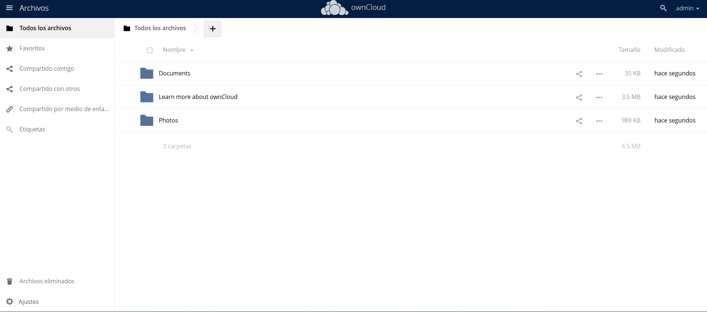
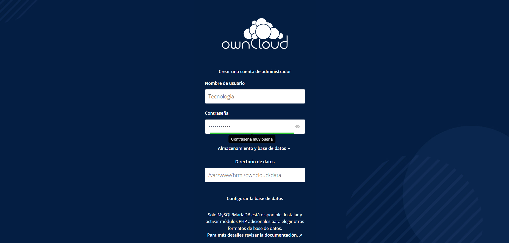

# ☁️ owncloud-ubuntu22-installer

Instalación automática de OwnCloud en Ubuntu 22.04 LTS. Script que despliega Apache, MySQL, PHP 7.4 y OwnCloud **con configuración automática de usuario administrador**.

---

## ⚠️ IMPORTANTE - ANTES DE EJECUTAR

### 1. CAMBIAR CONTRASEÑAS POR DEFECTO

Edita el archivo `install.sh` y **cambia estas variables** antes de ejecutarlo:

```bash
DB_ROOT_PASS='CambiarRootPassword123'   # ⚠️ CAMBIAR: Contraseña para root de MySQL
DB_USER_PASS='CambiarUserPassword123'   # ⚠️ CAMBIAR: Contraseña para usuario de OwnCloud (base de datos)
OC_ADMIN_PASS='AdminPassword123'        # ⚠️ CAMBIAR: Contraseña del administrador de OwnCloud
```

### 2. REQUISITOS DEL SISTEMA

- Ubuntu 22.04 LTS **limpio** (sin Apache/MySQL preinstalado)
- Conexión a Internet activa
- Ejecutar como root o con sudo
- Puertos 80 disponibles

---

## 📋 Descripción

**Problema que resuelve:**  
Las instalaciones tradicionales de OwnCloud requieren múltiples pasos manuales (Apache, MySQL, PHP, configuración de trusted domains y creación del usuario administrador). Este proceso puede tomar horas y es propenso a errores.

**Solución:**  
Este script automatiza la instalación completa de OwnCloud en Ubuntu 22.04, incluyendo:
- Apache2 + PHP 7.4 con todas las extensiones necesarias
- MySQL con base de datos y usuario optimizados
- Descarga y configuración automática de OwnCloud
- **Configuración automática del usuario administrador de OwnCloud** (sin intervención web)
- Instalación y habilitación de la app LDAP
- Trusted domains configuradas automáticamente
- Firewall configurado (con preservación del puerto SSH)

---

## 🚀 Tecnologías

| Tecnología | Versión | Puerto |
|------------|---------|--------|
| Ubuntu | 22.04 LTS | - |
| OwnCloud | 10.12.1 | 80 / 443 |
| Apache2 | 2.4 | 80 / 443 |
| MySQL | 8.0 | 3306 |
| PHP | 7.4 | - |

---

## ⚙️ INSTALACIÓN

### 1. Clonar repositorio

```bash
git clone https://github.com/Carlos-Silva-Sys/owncloud-ubuntu22-installer.git
cd owncloud-ubuntu22-installer
```

### 2. Dar permisos al script

```bash
chmod +x install.sh
```

### 3. Editar contraseñas (OBLIGATORIO)

```bash
nano install.sh
```

Busca y cambia estas tres variables:

```bash
DB_ROOT_PASS='CambiarRootPassword123'   # Contraseña para root de MySQL
DB_USER_PASS='CambiarUserPassword123'   # Contraseña para usuario de OwnCloud (base de datos)
OC_ADMIN_PASS='AdminPassword123'        # Contraseña del administrador de OwnCloud
```

### 4. Ejecutar como root

```bash
sudo ./install.sh
```

### 5. Esperar la instalación

El proceso tomará **5-10 minutos**.

### 6. Acceder a OwnCloud

```
http://IP_DEL_SERVIDOR
```

**Usuario:** `admin`  
**Contraseña:** (la que definiste en `OC_ADMIN_PASS`)

---

## 🔧 PASOS DESPUÉS DE EJECUTAR (OPCIONALES)

### Configurar LDAP / Active Directory

1. Inicia sesión como administrador
2. Ve a **Ajustes** → **Administración** → **LDAP / Active Directory**
3. Configura la conexión a tu servidor LDAP/AD

### Captura del dashboard



### Captura de la pantalla de login



---

## 📥 CLIENTE DE ESCRITORIO (WINDOWS)

Para conectar clientes Windows al servidor OwnCloud, descarga el cliente oficial:

🔗 [https://owncloud.com/desktop-app/](https://owncloud.com/desktop-app/)

Una vez instalado:
1. Ingresa la URL de tu servidor: `http://IP_DEL_SERVIDOR`
2. Usa las credenciales de tu usuario administrador (`admin` / la contraseña que definiste)
3. Selecciona las carpetas a sincronizar

---

## 🛠️ COMANDOS ÚTILES

```bash
# Verificar servicios
sudo systemctl status apache2 mysql

# Ver logs de OwnCloud
sudo tail -f /var/www/html/owncloud/data/owncloud.log

# Reiniciar servicios
sudo systemctl restart apache2 mysql

# Actualizar trusted domains si cambia la IP
sudo -u www-data php /var/www/html/owncloud/occ config:system:set trusted_domains 0 --value="NUEVA_IP"
```

---

## 📁 Estructura del proyecto

```
owncloud-ubuntu22-installer/
├── install.sh
├── README.md
└── images/
    ├── Dashboard_OwnCloud.png
    ├── Login_OwnCloud.png
    └── Instalacion_web.png
```

---

## 📝 Autor

Carlos Silva  
GitHub: [@Carlos-Silva-Sys](https://github.com/Carlos-Silva-Sys)

---

## 📌 Nota de seguridad

Todas las credenciales mostradas son ejemplos. En producción, use contraseñas seguras.
