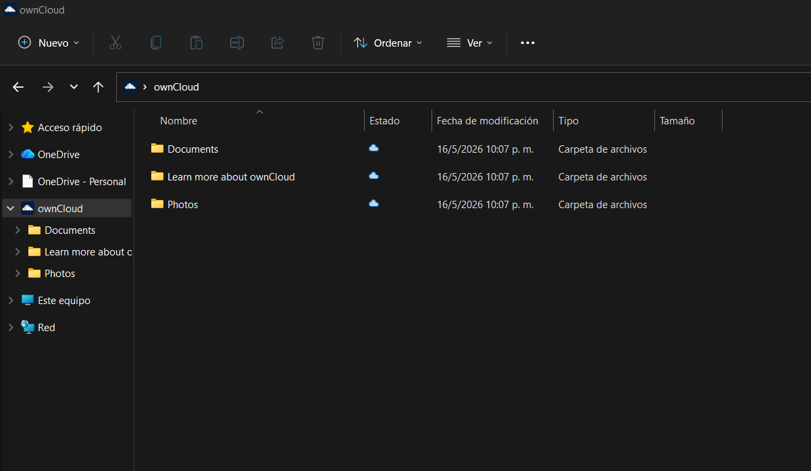

# ☁️ owncloud-ubuntu22-installer

**¿Instalar OwnCloud? Tú eliges cómo.**

👇 TE MUESTRO AMBAS FORMAS

---

## 🐳 VERSIÓN RÁPIDA (Docker)

**1 comando. 1 minuto. Todo listo.**

```bash
docker run -d \
  --name owncloud \
  -p 80:8080 \
  -e OWNCLOUD_ADMIN_USERNAME=admin \
  -e OWNCLOUD_ADMIN_PASSWORD=TuClaveSegura123 \
  -e OWNCLOUD_TRUSTED_DOMAINS=192.168.1.111 \
  -v owncloud-data:/mnt/data \
  owncloud/server:latest
```

✅ **Portable, limpio, fácil de actualizar.**  
👉 [Repositorio completo con documentación Docker](https://github.com/Carlos-Silva-Sys/owncloud-docker-installer)

---

## 📝 VERSIÓN COMPLETA (Script nativo)

**Apache, MySQL, PHP, LDAP paso a paso. Ideal para entender qué pasa detrás.**

```bash
git clone https://github.com/Carlos-Silva-Sys/owncloud-ubuntu22-installer.git
cd owncloud-ubuntu22-installer/script-nativo
chmod +x install.sh
sudo ./install.sh
```

✅ **Control total, aprendizaje profundo.**

---

## 📸 CAPTURAS DE PANTALLA

### Pantalla de login


### Dashboard principal


### Vista de archivos



---

## 📥 CLIENTE DE ESCRITORIO (WINDOWS)

Para sincronizar archivos con tu PC, descarga el cliente oficial:

🔗 [https://owncloud.com/desktop-app/](https://owncloud.com/desktop-app/)

Una vez instalado:
1. Ingresa la URL de tu servidor: `http://IP_DEL_SERVIDOR`
2. Usa las credenciales de tu usuario administrador
3. Selecciona las carpetas a sincronizar

---

## 📁 ESTRUCTURA DEL PROYECTO

```
owncloud-ubuntu22-installer/
├── README.md                 ← Este archivo
├── script-nativo/
│   └── install.sh            ← Script de instalación nativa
└── images/
    ├── Login_owncloud.png
    ├── Dashboard_owncloud.png
    └── Instalacion_web.png
```

---

## 📝 AUTOR

Carlos Silva  
GitHub: [@Carlos-Silva-Sys](https://github.com/Carlos-Silva-Sys)

---

## 📌 NOTA DE SEGURIDAD

Cambia las contraseñas y dominios por los de tu entorno. No uses valores por defecto en producción.
